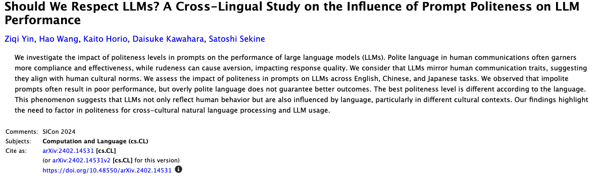

# Hype to Help: Demystifying AI for Everyday Impact

## James Gress
_Advanced Technology Center AI Lead Accenture_

<i class="fa-brands fa-linkedin"></i> LinkedIn: - [jamesgress](https://linkedin.com/in/jamesgress/)  
<i class="fa-brands fa-github"></i> GitHub: [jmgress](https://github.com/jmgress)  
<i class="fa-brands fa-x-twitter"></i> X.com: [@jmgress](https://x.com/jmgress)  
<i class="fa-brands fa-meetup"></i> [Tampa Bay Generative AI Meetup](https://www.meetup.com/tampa-bay-generative-ai-meetup/)  
<i class="fa-brands fa-meetup"></i> [Tampa Bay DevOps Meetup](https://www.meetup.com/tampa-devops-meetup/)
<i class="fa-brands fa-meetup"></i> [Tampa Bay Platform Engineering Meetup](https://www.meetup.com/tampabayplatformengineering/)
<!-- 
Done 100's of Prototypes
Taken 10 applications to Production ranging from simple RAG to more complex Agentic systems
Specialize in AI in the SDLD or TDLC
-->
---

# What Is Generative AI?

- **Creates new content** instead of just finding existing info  
- Examples: text, images, code, creative ideas  
- **Pattern-based prediction**, not thinking or consciousness  
- Uses **Large Language Models (LLMs)** trained on vast data to predict what comes next  

**💡 Simple Analogy:**  
Like a super-powered autocomplete — it’s read billions of examples, learned the patterns, and predicts the next word, pixel, or note until the work is complete.  
The results can look creative or logical, but it’s really just *very good prediction*.

---

# From Data to Intelligence: How AI Models Are Born

<!-- You have to watch out for this and check your work, it has told me things that didn't exist, just becuase of the way I worded it -->

---

# How to Use Generative AI & LLMs (Live)

<!-- This a general audience discussion on how some of AI tools work and what are we exactly talking to, will be using ChatGPT but
there are many others, and a lof of them have similer features.

Somthings work really well, however somethings don't, and somethings if we give it a bit better context can get more out of them 

type in "What are you?, "What are you?, How did you get created" -->

---

# The easy part is the ask.. you simply ask it want you want.

Youd don't always get what you want, but sometimes you just might find you get what you need.

"Please help me write an email to ask my boss for a raise."

---

# How do we make it better

Basic prompting... persona, context, ask, example of showing exemplars

Becareful on how you ask it, if you direclty tell it to do something, it will try to accomplish that. 

---

My new favorite is using "Something Like" or "Like" 

---

# the other major area is context

---

Let's get back to the tooling and how it seems to understand and know us, this will help us give it the right context so it can pull the right information together to give us better responses.

---

What they are good at doing and what they are not good at doing... example if I have 100 documents and tell the model to give me information that would require all 100 documents it isn't going to give you what you want. 

It isn't always trueful.... you have to validate ... you are the one that is responsible for the work produced.

---

Show all of the common AI chats that seem to be most prevelent

Grok - Tied to tweets
Meta - Tied to Facebook
Google and Gemini - Great at searching and returing answers
Perplexity
Mixtral

---

<!-- Point out that people tend to get comfortable with the methodology they get used to, on this talk I am not trying to convince you to change but only show you how I have been using these things, and in this space things are changing rapidly -->

---

<!-- You have to watch out for this and check your work, it has told me things that didn't exist, just becuase of the way I worded it -->

---

<!-- You have to watch out for this and check your work, it has told me things that didn't exist, just becuase of the way I worded it -->

---

<!-- You have to watch out for this and check your work, it has told me things that didn't exist, just becuase of the way I worded it -->

---

<!-- You have to watch out for this and check your work, it has told me things that didn't exist, just becuase of the way I worded it -->

---

Normailze a list

---

Give it a format 

---

Creating a project in perplexity or chatgpt

---

Creating powerpoints with gamma.app

---

## Introduction
**Who is James Gress?**  
- Generative AI & Software Engineering Leader  
- Speaker, innovator, and AI practitioner  
- Today’s session: live exploration of AI, Generative AI, and LLMs

**Agenda**
- What AI, Generative AI, and LLMs are
- How they work
- How to get the most out of them
- Live demos
- Real-world applications

Note:
Open with energy. Let them know this is an interactive session. Mention your background and that you’ll be showing real tools in action.

---

## Setting the Stage

**From AI → Generative AI → LLM**
- **AI**: Broad category of systems that can mimic human intelligence.
- **Generative AI**: Creates new content (text, images, code, etc.).
- **LLM (Large Language Model)**: Specialized AI trained on vast text data.

Note:
Use OpenAI to generate short, engaging definitions for each term as a live example.

---

## Industry Perspective

> *"English is the new programming language."* – Jensen Huang  
> *"AI-driven automation will create new industries we can’t even imagine yet."* – Elon Musk  
> *"AI is the runtime… shaping applications and platforms."* – Satya Nadella

Note:
Set the tone with leaders’ visions. Highlight how transformational shifts always have enthusiasts, wait-and-seers, and contrarians.

---

## Under the Hood: How It Works

- How an LLM is created: training data, parameters, probability prediction
- Training cut-off date limits
- Getting current data into an LLM: RAG (Retrieval-Augmented Generation)
- Why LLMs don’t truly “remember”
- Context windows: why you should start a new thread for a new topic

Note:
Explain memory vs. context. Show in OpenAI how context affects results.

---

## Prompting Basics

**The Prompt Equation**  
Task → Context → Examples → Persona

**Live Demo**:  
1. Email to leadership on benefits of ChatGPT at work  
2. Prompt to ask for a raise (include task, context, examples, persona)

Note:
Stress that more detail = better results. Show quick differences between vague and specific prompts.

---

## Tool Showcase

**We’ll explore**:  
- OpenAI (ChatGPT, DALL·E) → Ford Raptor image  
- Grok (x.com sentiment, posts)  
- Mistral  
- Perplexity  
- Claude (coding strength)  
- Microsoft Copilot  
- Gemini  
- LM Notebooks

Note:
Mention you’re using these because they’re familiar and safe for public demo, not necessarily “the best.”

---

## Leaderboards

**Model Leaderboards**  
- Overview of top LLM performance rankings
- Trends in speed, accuracy, and reasoning

Note:
Open an actual leaderboard site live and show a few entries.

---

## What Else Can It Do? (Live Demos)

**Creative**:
- Music, songs
- Translator
- Image recognition (foreign signs)
- Drawing (org charts)

**Practical**:
- Resume from skills
- Interview prep
- Normalize unstructured data
- Deep research
- Vibe coding
- Podcast script in LM Notebook

Note:
Pick 2–3 to do live based on time and audience interest.

---

## Generative AI in Software Engineering

**Opportunities**:
- Accelerates delivery
- Generates new functionality quickly

**Challenges**:
- Still needs experienced engineers
- Skills gap in prompt-driven development
- Testing and DevOps integration gaps
- Security risks, rapid model changes

Note:
Tie back to your professional expertise. This is where “knowing AI” becomes a career advantage.

---

## Business & Career Implications

**For Individuals**:
- Tailor resumes, match job descriptions
- Interview coaching
- Learn prompt engineering

**For Organizations**:
- Productivity gains from AI training
- Governance via AI Centers of Excellence
- Manage data security risks

> *"AI won’t replace you, but people who know AI will."* – Jensen Huang

Note:
Drive home the urgency to learn.

---

## Closing & Call to Action

**Key Takeaways**:
1. Start experimenting  
2. Learn prompt patterns  
3. Integrate AI into daily workflows  

**Final Quote**:
> *"English is the new programming language."*

Note:
End on inspiration. Invite Q&A and offer resources after the session.

---

# How models are created

---

# Getting Started

---

Learning with Advanced Voice Mode while Driving
Have it save stuff

Quick action on your phone to avanced AI voice 

---

Editing images
Use an image to get a style...

Color Correction

---

Memory and checking it... don't know where it is in your system... just ask

---

Using AI for search... really liking Google

---

marp: true
theme: default

# How to Use Generative AI & LLMs (Live)

---

## Introduction
**Who is James Gress?**  
- Generative AI & Software Engineering Leader  
- Speaker, innovator, and AI practitioner  
- Today’s session: live exploration of AI, Generative AI, and LLMs

**Agenda**
- What AI, Generative AI, and LLMs are
- How they work
- How to get the most out of them
- Live demos
- Real-world applications

Note:
Open with energy. Let them know this is interactive. Mention your background and that you’ll show real tools in action.

---

## Setting the Stage

**From AI → Generative AI → LLM**
- **AI**: Broad category of systems that mimic human intelligence.
- **Generative AI**: Creates new content (text, images, code, etc.).
- **LLM (Large Language Model)**: AI trained on vast text datasets to understand and generate language.

**Live Demo:**  
Ask OpenAI: *"Explain AI, Generative AI, and LLM in one sentence each."*

Note:
Use the live demo to make definitions engaging.

---

## Industry Perspective

> *"English is the new programming language."* – Jensen Huang  
> *"AI-driven automation will create new industries we can’t even imagine yet."* – Elon Musk  
> *"AI is the runtime… shaping applications and platforms."* – Satya Nadella

Note:
Highlight how every big tech shift has enthusiasts, wait-and-seers, and contrarians.

---

## How Models Are Created

**LLM Training Basics**:
- Data collection
- Tokenization
- Neural network training
- Parameters & probability prediction
- Training cut-off dates

**Live Demo:**  
Ask ChatGPT: *"Explain how an LLM is trained"*, then have it create a simple diagram.

Note:
This builds understanding before we talk about using them effectively.

---

## Getting Started

**Steps:**
1. Pick a tool you’re comfortable with.
2. Start with a small, practical task.
3. Learn prompt patterns early.

Note:
This is the bridge from theory to hands-on.

---

## Prompting Basics

**The Prompt Equation**  
Task → Context → Examples → Persona

**Live Demos**:  
1. Vague vs. structured email prompt about ChatGPT benefits at work.  
2. Prompt to ask for a raise using task, context, examples, persona.

Note:
Show how more detail transforms results.

---

## Memory in AI

- LLMs don’t store personal info unless in app’s memory.
- Session context is temporary.
- Check memory: just ask the AI what it remembers.

**Live Demo:**  
Ask ChatGPT: *"What do you remember about me?"*

Note:
Explain reasons for clearing chat and starting new threads.

---

## Tool Showcase

**We’ll explore**:  
- **OpenAI** – ChatGPT, DALL·E (Ford Raptor image)  
- **Grok** – x.com sentiment & posts  
- **Mistral** – Open-weight model  
- **Perplexity** – Web-integrated reasoning  
- **Claude** – Strong coding capability  
- **Microsoft Copilot** – Office integration  
- **Gemini** – Google multimodal  
- **LM Notebooks** – Long-context special features

**New Additions**:
- **Google Search with AI** – Deep research  
- **Advanced Voice Mode** – Quick voice interaction  
- Saving notes while driving example  
- Quick action on phone to open AI voice

Note:
Mention you’re using these because they’re safe for public demo, not necessarily “the best.”

---

## Leaderboards

- Model performance rankings
- Trends in speed, accuracy, reasoning

**Live Demo:**  
Open LMSYS Chatbot Arena Leaderboard and show top models.

Note:
Adds credibility to model choices.

---

## Editing Images with AI

**Capabilities**:
- Style transfer from another image
- Color correction
- Modify small details

**Live Demo:**  
Upload an image, match a style, correct colors.

Note:
Show how quickly visual edits can be done without pro design skills.

---

## What Else Can It Do?

**Creative**:
- Music, songs
- Translator
- Image recognition (foreign signs)
- Drawings (org charts)

**Practical**:
- Resume from skills
- Interview prep
- Normalize unstructured data
- Deep research
- Vibe coding
- Podcast script in LM Notebook

Note:
Choose a mix of practical and fun for the live segment.

---

## Generative AI in Software Engineering

**Opportunities**:
- Accelerates delivery
- Generates functionality quickly

**Challenges**:
- Needs experienced engineers
- Skills gap in prompt-driven dev
- Testing & DevOps integration gaps
- Security risks, rapid model changes

Note:
Tie back to your professional expertise.

---

## Business & Career Implications

**For Individuals**:
- Tailor resumes, match job descriptions
- Interview coaching
- Learn prompt engineering

**For Organizations**:
- Productivity gains from AI training
- Governance via AI Centers of Excellence
- Manage data security risks

> *"AI won’t replace you, but people who know AI will."* – Jensen Huang

Note:
Reinforce the need to learn and adapt.

---

## Closing & Call to Action

**Key Takeaways**:
1. Start experimenting  
2. Learn prompt patterns  
3. Integrate AI into daily workflows  

**Final Quote**:
> *"English is the new programming language."*

Note:
End with energy and open Q&A.

